# Sistem Pencarian Dokumen Penelitian

Algoritma Cosine Similarity pada Sistem Pencarian Dokumen Penelitian

## Language

-  
- 
-  
-  

## Database

- 

## Framework 

- 
- 

## Library

- 
- 
- 
- 

## Tools 

-  
-  

## Platform

- 

## Screenshoot
- #### Home
    
    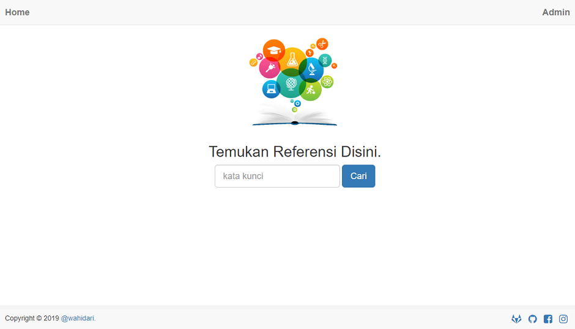
    
- #### Search Result

    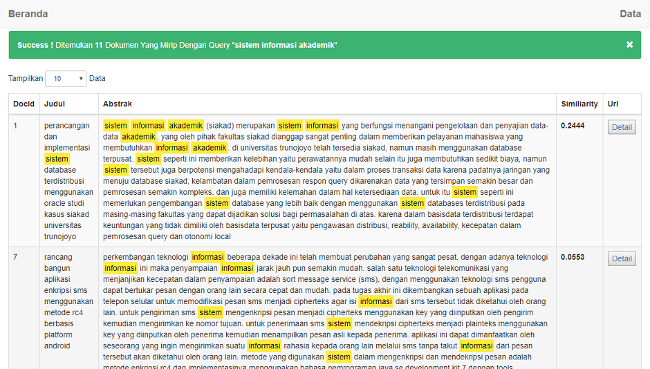
 
- #### Dataset

    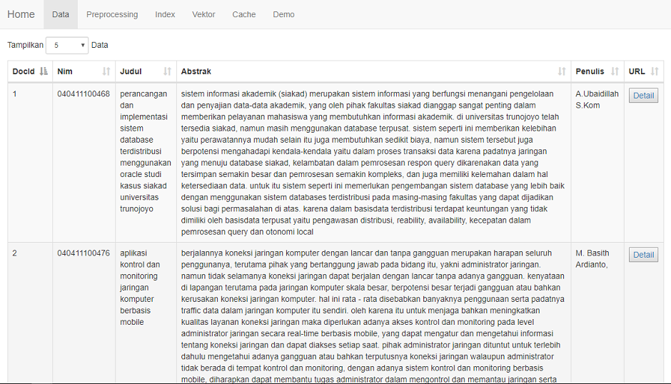
    
- #### Preprocessing

    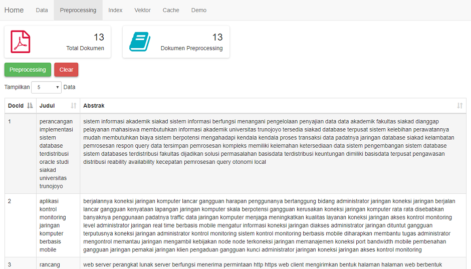
    
- #### Index & Weight

    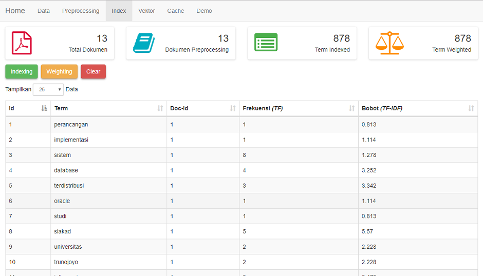
    
- #### Vector Length

    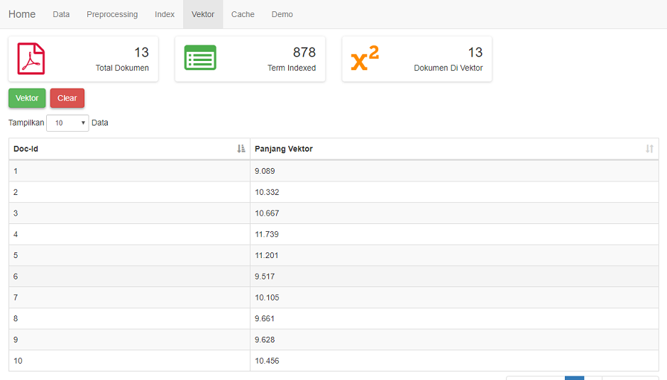
    
- #### Cache

    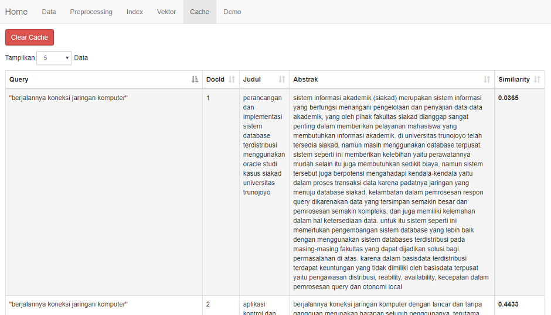
    
- #### Demo

    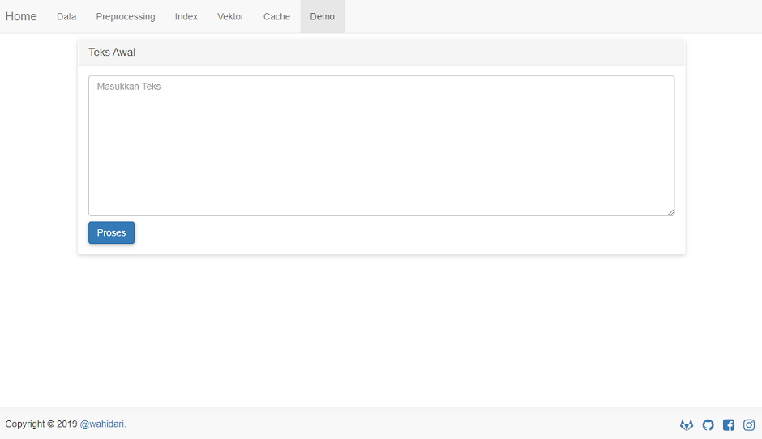

    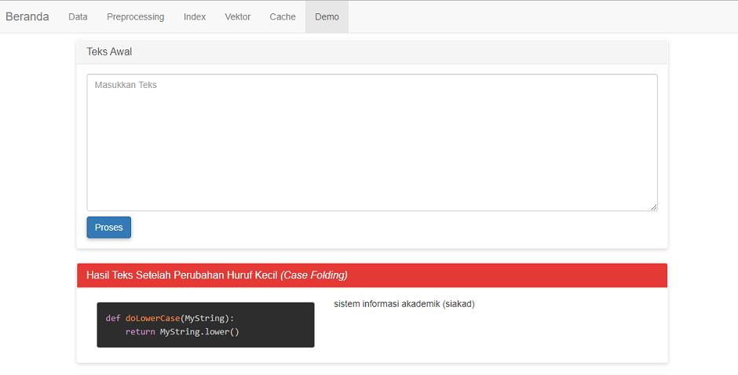
    
    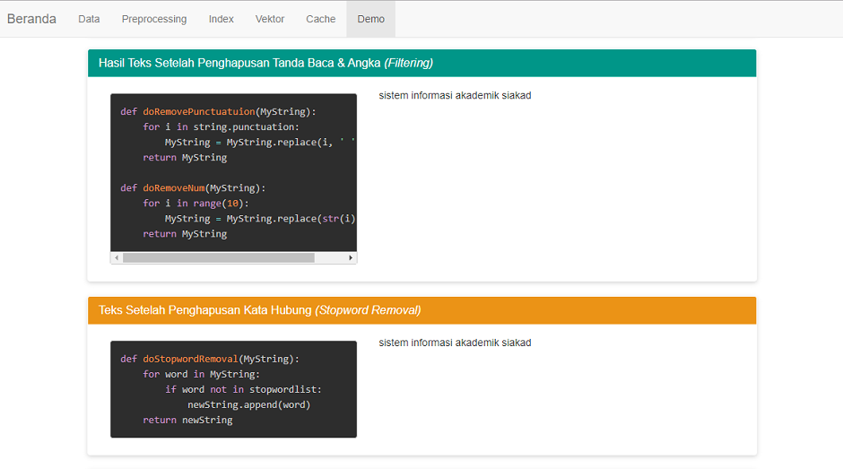
    
    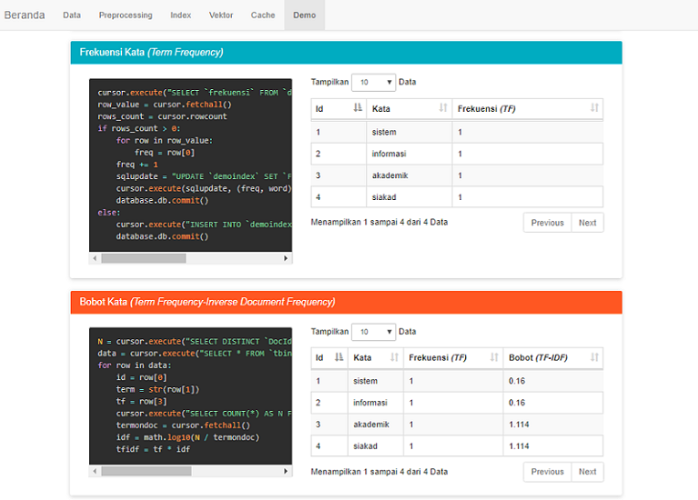
        
    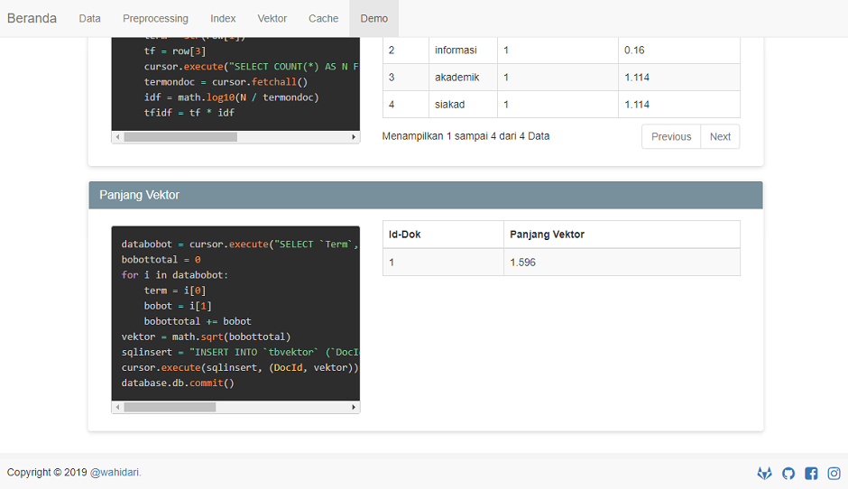
    
## License

-  
> This program is Free Software: 
You can use, study, share and improve it at your will. 
Specifically you can redistribute and/or modify it under the terms of the [GNU General Public License](https://www.gnu.org/licenses/gpl.html) 
as published by the Free Software Foundation, either version 3 of the License, or (at your option) any later version.